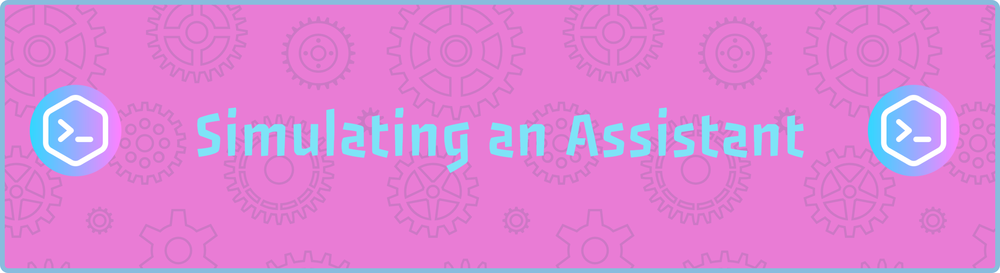
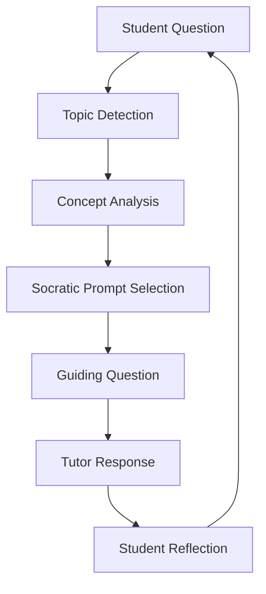

# 🤖 Socratic Coding Tutor
<p align="center">
  
</p>

<p align="center">


</p>

<p align="center">
  
</p>

<p align="center">
  
  
  
  
</p>

## 📖 Overview

Socratic Coding Tutor is an AI-inspired educational chatbot designed to teach programming concepts through guided questioning rather than direct answers.

The project demonstrates how Prompt Engineering, Persona Design, and Assistant Simulation can be used to create a learning-focused conversational experience.

---

## ✨ Key Features

* Socratic teaching methodology
* Interactive chat interface
* Multiple programming topics
* Typing animation simulation
* Responsive design
* Quick-start prompts
* No backend required
* Runs entirely in the browser

---

## 🏗 Project Structure

```text
socratic-tutor/
├── index.html
├── style.css
├── script.js
├── system_prompt.txt
├── sample_conversations.md
└── assets/
    └── banner.png
```

## 🔄 Assistant Workflow



## 🚀 Technologies Used

* HTML5
* CSS3
* JavaScript
* Prompt Engineering
* Persona Design
* Assistant Simulation

## 🎯 Learning Objective

Rather than giving answers immediately, the tutor encourages learners to think critically, reason independently, and discover solutions through guided exploration.

## Customising Responses
Open script.js and edit the RESPONSES object at the top of the file. Each key holds an array of strings; the tutor picks one at random per conversation turn.
To add a new topic:
js// 1. Add a key to RESPONSES
RESPONSES.newTopic = [
  "Your first guiding question here.",
  "A second alternative question."
];

// 2. Add a branch in pickResponse()
if (t.includes('your keyword')) return rand(RESPONSES.newTopic);

## Design
Typography — Fraunces (italic serif headings) + DM Mono (monospace body)
Palette — warm amber accent (#c9a96e) on a deep dark background
Fonts — loaded from Google Fonts; requires an internet connection on first load

## flowchart TD

A[Student Question]
--> B[Keyword Detection]

B --> C[Identify Coding Concept]

C --> D[Select Socratic Prompt]

D --> E[Generate Guiding Question]

E --> F[Tutor Response]

F --> G[Student Thinks and Replies]

G --> A


## Browser Support
Works in all evergreen browsers (Chrome, Firefox, Safari, Edge). Uses 100dvh for full-height layout on mobile — supported in all modern browsers as of 2023.